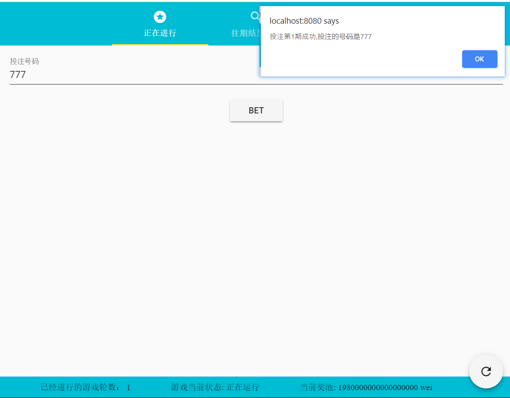

# 1. 区块链最终项目


<details>
  <summary>目录</summary>

<!-- TOC -->

- [1. 区块链最终项目](#1-区块链最终项目)
    - [1.1. 项目结构](#11-项目结构)
    - [1.2. 如何运行](#12-如何运行)
    - [1.3. 本地重新构建开发环境](#13-本地重新构建开发环境)
        - [1.3.1. 从github 拉取仓库](#131-从github-拉取仓库)
        - [1.3.2. 安装 truffle](#132-安装-truffle)
        - [1.3.3. 配置私有链](#133-配置私有链)
            - [1.3.3.1. 使用truffle development](#1331-使用truffle-development)
            - [1.3.3.2. 使用ganache](#1332-使用ganache)
            - [1.3.3.3. 使用geth构建私有链](#1333-使用geth构建私有链)
        - [1.3.4. 修改 migrations文件内的内容](#134-修改-migrations文件内的内容)
        - [1.3.5. 配置truffle-config.js](#135-配置truffle-configjs)
        - [1.3.6. 部署合约到私有链上](#136-部署合约到私有链上)
        - [1.3.7. 在浏览器安装 metamask](#137-在浏览器安装-metamask)
        - [1.3.8. 配置 metamask](#138-配置-metamask)
        - [1.3.9. 本地搭建简单服务器运行前端代码](#139-本地搭建简单服务器运行前端代码)
    - [1.4. 应用基本组成](#14-应用基本组成)
        - [1.4.1. 基本组件](#141-基本组件)
        - [1.4.2. 管理者（Manager）](#142-管理者manager)
        - [1.4.3. 参与者（Player）](#143-参与者player)
        - [1.4.4. 受助者（Recipient）](#144-受助者recipient)
    - [1.5. 测试](#15-测试)
        - [1.5.1. 测试条件说明](#151-测试条件说明)
        - [1.5.2. 测试过程：](#152-测试过程)
            - [1.5.2.1. Manager 创建一个新的游戏](#1521-manager-创建一个新的游戏)
            - [1.5.2.2. Player1进行投注](#1522-player1进行投注)
            - [1.5.2.3. Player2进行投注](#1523-player2进行投注)
            - [1.5.2.4. Manager 执行 `Reveal` 进行开奖](#1524-manager-执行-reveal-进行开奖)
            - [1.5.2.5. Player进行投注结果查询](#1525-player进行投注结果查询)
            - [1.5.2.6. 获奖的用户领取奖金](#1526-获奖的用户领取奖金)
            - [1.5.2.7. Manager 将就Recipient 添加到受助者名单中](#1527-manager-将就recipient-添加到受助者名单中)
            - [1.5.2.8. Recipient 领取救助金](#1528-recipient-领取救助金)
    - [1.6. 缺陷与展望](#16-缺陷与展望)
    - [1.7. 参考](#17-参考)

<!-- /TOC -->

</details>

## 1.1. 项目结构

- vue.js 作为前端框架
- vuetify 作为前端的 css 框架
- web3 用于和智能合约交互
- truffle 作为整体开发框架 
- ganache 开发时的区块链 / geth  搭建私有链

## 1.2. 如何运行

 以下是一种简单的运行方式（区块链环境有多种选择，下面介绍的只是一种比较方便的方案）

1. 打开 truffle  自带的内存中的区块链 ` truffle develop` 
2. 在打开的控制台(truffle developement)中部署合约， `truffle migrate`
3. 保持上一个控制台处于运行状态，重新打开一个终端，进入 vue-client-lite，使用 `npm install && npm run serve` 创建一个简单的服务器。
4. 打开浏览器，配置 `metamask`  之后就可以在`8080`（默认）看到对应的页面。【具体操作见下面的介绍】

## 1.3. 本地重新构建开发环境

### 1.3.1. 从github 拉取仓库

```shell
git clone <本仓库地址>
```

### 1.3.2. 安装 truffle 

[truffle官网]( https://truffleframework.com/docs)有详细的教程.

```shell
npm -g install truffle@<version>
```

### 1.3.3. 配置私有链

有以下几种方式可以构建私有链， 前两种方式都是直接在内存中模拟一条私有链，当你关闭重启之后所有的状态都会重置，主要使用于开发环境。

#### 1.3.3.1. 使用truffle development

```shell
# 进入 truffle console, 会默认在 9545 端口开放一个 rpc 调用端口。  
truffle develop
```


#### 1.3.3.2. 使用ganache 

这里直接使用从 truffle 官网下载的图形版，直接运行即可


#### 1.3.3.3. 使用geth构建私有链

1. 安装geth，初始化私有链

geth 的安装可以去官网下载，在`geth-config`文件夹中含有对应的配置区块链的文件`genesis.json`。

``` shell
geth init <your_genesis.json> 
```

2. 使用私有链的在发现交易的时候自动交易的脚本, 仓库中有一个样例代码，可以在 `geth_config` 文件夹中找到 `auto-mining.js`。

```javascript
// mine when there is 
var mining_threads = 4

function checkWork() {
    if (eth.getBlock("pending").transactions.length > 0) {
        if (eth.mining) return;
        console.log("== Pending transactions! Mining...");
        miner.start(mining_threads);
    } else {
        miner.stop();
        console.log("== No transactions! Mining stopped.");
    }
}

eth.filter("latest", function(err, block) { checkWork(); });
eth.filter("pending", function(err, block) { checkWork(); });

checkWork();
```

2. 运行节点

按照geth的文档，运行节点的，需要注意的在运行的时候打开对应的选项比如 `rpc` 和 `cors`， 具体可以参考 `run_geth.sh`。

``` shell

# 使用 run_geth.sh 运行节点
./run_geth.sh [想要节点运行的ip，默认是运行在localhost]

```


### 1.3.4. 修改 migrations文件内的内容

按照官方文档的解释，这个文件夹中的文件是用来将solidity 源代码部署到去对应的区块链上的代码，本项目只用到了最基本的部署，高级用法请看官网文档。

### 1.3.5. 配置truffle-config.js

本项目只配置了简单的配置了网络，以及生成 build的文件的位置。

### 1.3.6. 部署合约到私有链上

``` shell
# 没有使用 reset 的话可能会出现 out-of-gas, 原因暂时不明白
truffle migrate --reset
```

### 1.3.7. 在浏览器安装 metamask  

metamask 可以在`chrom store` 中找到，直接安装即可。

### 1.3.8. 配置 metamask

在本地节点建立用户，之后将用户导入对应 metamask 中。

- 通过私钥导入用户，这个方法比较直观，直接把账户的私钥输入，之后就能通过 `metamask` 操作这个账户。
- 通过 geth 中的 `keystore`文件导入，实际上我们可以看到，在使用这种方法的时候，会提示需要输入密码，这个密码就是在 geth 节点中使用 `personal.newAccount` 创建账户的时候使用的密码。


在本地打开 keystore 中的 `utc-***.json`我们可以发现，实际上两种方法都是一样的，这个文件实际上使用了加密算法(aes) 。

 

### 1.3.9. 本地搭建简单服务器运行前端代码

``` shell 
# navigate to directory of vue-client-lite, then run the instruction blow 
npm install && npm run serve
```

然后通过浏览器打开 `localhost:8080` （开发服务器监听的端口）即可。

## 1.4. 应用基本组成

### 1.4.1. 基本组件

- 状态栏

    - 当前已经进行游戏的轮数
    - 是否存在游戏进行
    - 当前奖池的数目

- 刷新按钮 =》 点击之后可以更新状态栏的状态.

### 1.4.2. 管理者（Manager）

- 游戏管理

    - 开启新的游戏 =》 new_game，开启新的游戏

    - 开奖 =》reveal,通过管理者运行的开奖函数

- 添加新的受助者

    - 增加/更新受助者以及其可以领取的金额 =》add_or_update

    - 查看当前可以领取的救助金的数额

### 1.4.3. 参与者（Player）

- 输入金额进行投注 =》 bet
- 查看往期的开奖情况 =》 search
- 查看自己是否有奖金可以领取 =》 withdraw_reward 

### 1.4.4. 受助者（Recipient）

需要领取的金额数目，领取对应的金额 =》getRecipient

## 1.5. 测试

### 1.5.1. 测试条件说明

- 测试环境
    - 运行在 `win10 ` + `chrome ` 
    - 使用 `Geth/v1.7.3 ` 搭建的私有链 
    - 使用 `metamask` 连接搭建的私有链
- 测试用户

    - 一个`Manager` 用于创建游戏和管理福利资金（抽取游戏中的手续费）
    - 两个`Player`, 用于在管理者创建的游戏中进行投注。
    - 一个 `Recipient` ，由于领取分配的救助金。

### 1.5.2. 测试过程：

#### 1.5.2.1. Manager 创建一个新的游戏

- manager 开启一轮新的游戏

  

- 区块链确认成功后

  

#### 1.5.2.2. Player1进行投注

- 玩家1进行投注

  

- 玩家1投注之后

  - 

#### 1.5.2.3. Player2进行投注

- 玩家2进行投注

  

- 投注区块链确认之后，当前奖池的金额发生变化

  

#### 1.5.2.4. Manager 执行 `Reveal` 进行开奖

- 输入开奖的号码进行开奖

  

- 开奖之后，当前游戏结束，如果有玩家中奖，会清空奖池。

  

#### 1.5.2.5. Player进行投注结果查询

- 输入查询的期号查询这一期的开奖结果

  

#### 1.5.2.6. 获奖的用户领取奖金

- 根据提示领取奖金

    

- 每次领取都会取出所有的奖金发送到用户账户中

  

#### 1.5.2.7. Manager 将就Recipient 添加到受助者名单中

- 每次投注的时候都会抽取一部分的手续费用于慈善事业，输入受助者的地址和金额进行受助者的注册

  

#### 1.5.2.8. Recipient 领取救助金

- 输入希望领取的救助金的数额，进行领取

  

- 获取之后，界面执行对应的更新

  

## 1.6. 缺陷与展望

- 开奖过程的优化，这里的开奖是基于第三方(manager)绝对可信的条件下，从本质来看，只是对现有的福利彩票的一个简单的"前端"模型，"后端"的开奖还是要依靠现实的摇号的随机机制。要实现区块链上的"随机数"生成，大概有以下
  - 随机数生成器来生成随机数，不过 seed 的获得是一大难题，采用区块 hash，或者其他和区块相关的数据作为种子，都会让这个随机数一定程度上被矿工所控制，导致随机性没有那么高。
    - 预言机 Oracle，提供"绝对"可行的第三方。
  - 基于密码学的随机开奖过程，大致流程在参考中的2。
- 过于粗糙的UI设计，水平有限，前端写得比较暴力粗糙，有挺多不合规范的地方。


## 1.7. 参考

1. truffle 官方文档 : https://truffleframework.com/docs

2. 关于区块链随机数生成的探讨 : https://ethereum.stackexchange.com/questions/191/how-can-i-securely-generate-a-random-number-in-my-smart-contract

3. 在出现交易的时候进行挖矿(auto minging) : https://ethereum.stackexchange.com/questions/3151/how-to-make-miner-to-mine-only-when-there-are-pending-transactions)

4. vue.js : https://vuejs.org/
5. UI framework vuetify:  https://vuetifyjs.com